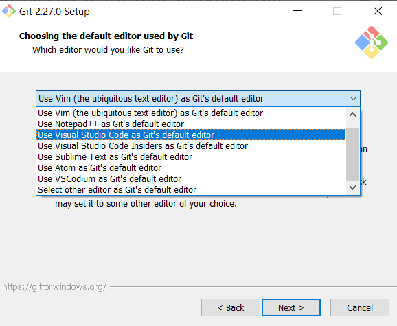
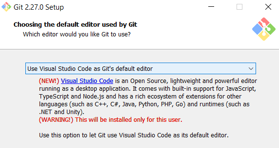
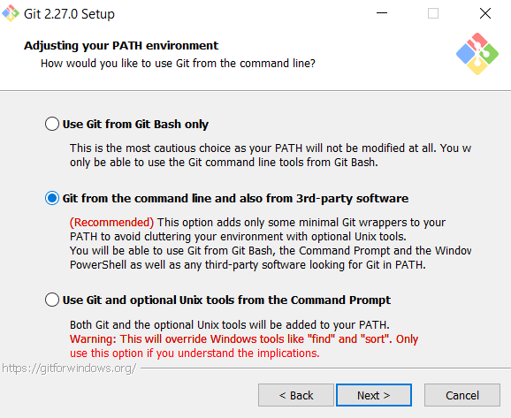
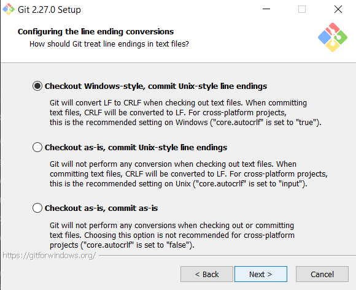
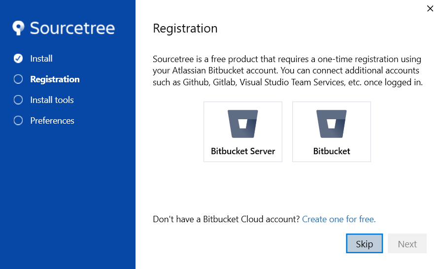
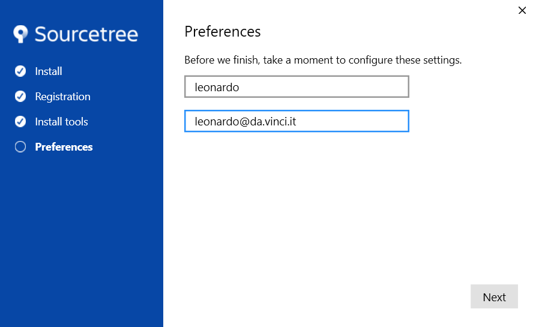
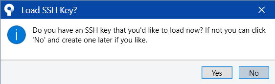

# Necesar software curs git - IUL-2020

Salut,

dacă participați la cursul de git, vă rog să vă asigurați că aveți instalate următoarele pachete software:

- git
- Visual Studio Code (vscode) + extensions
- SourceTree
- TortoiseGit (optional)

## git

  
Dacă sunteți pe Windows, <https://git-scm.com/download/win>.  
Pentru alte sisteme de operare, descărcați o versiune specifică dacă nu aveți deja una instalată.

### git-for-windows config

În cursul instalării de git pentru windows, puteți lăsa **în general** pe valorile default setările. Dar sunt câteva setări pe care le recomand să le modificați:

Pentru a rula git-pentru-windows, vă recomand să înlocuiți vim cu alt editor (ex: Notepad++, Visual Studio Code, etc).
> 

În exemplul acesta, am ales să folosesc Visual Studio Code:  
> 

Dacă nu este setată din oficiu opțiunea de "git from the command line and also from 3rd-party software", vă rog să o bifați.  
> 

Când lucrați cu git pentru windows, e recomandat să vă ajustați line-endings să fie specifice sistemului de operare. Ar trebui să fie implicit, dar verificați că este setat "Checkout Windows-style, commit Unix-style line endings":  
> 

## vscode

  
E open source, e foarte la modă în ultima vreme, și îl puteți descărca de pe : <https://code.visualstudio.com/>

### vscode-plugins

Pentru a vă ajuta mai mult în lucrul cu git, vă recomand instalarea unor plug-in-uri/extensii de vscode:

- mhutchie.git-graph (https://github.com/mhutchie/vscode-git-graph.git)
- eamodio.gitlens (https://github.com/eamodio/vscode-gitlens.git)
- davidanson.vscode-markdownlint (https://github.com/DavidAnson/vscode-markdownlint.git)

## SourceTree

E un client de git free cu o interfață destul de bogată.
Îl găsiți aici: <https://www.sourcetreeapp.com/>.

### SourceTree config

Puteți spri peste înregistrare în versiunea aceasta.

Minimul necesar este reprezentat de instalarea de Git.
Dacă nu aveți deja Git instalat, SourceTree își va downloada propria versiune. Poate fi configurat ulterior să folosească versiunea de sistem.  

Puteți specifica un user-name și user-email. Vom face asta și în cadrul cursului.

Nu e nevoie să adăugați chei de SSH. Vom face asta în cadrul cursului.

## TortoiseGit

**(Opțional)** Se găsește aici: <https://tortoisegit.org/>.  
E un client de git cu un mod de lucru alternativ, integrat în Windows Explorer. Din păcate nu știu ceva echivalent pentru Linux/Mac. Se poate și fără el, dar are un tool de comparare pe care îl apreciez și integrare cu Windows Explorer.
